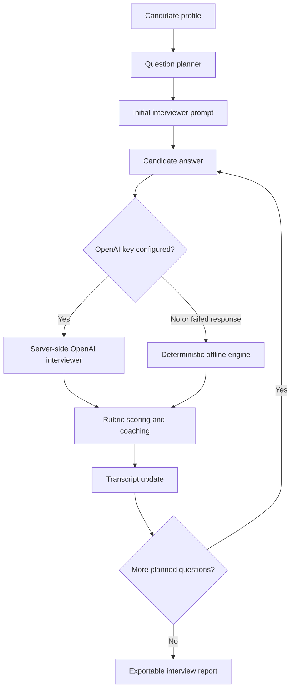

# Interview Practice Bot

Interview Practice Bot is a local-first mock interview practice app for job seekers, career coaches, bootcamp mentors, and teams preparing candidates for structured interviews. It helps users rehearse behavioral, technical, system design, and mixed interviews with planned questions, adaptive follow-ups, rubric scoring, transcript history, and exportable coaching notes.

The app runs as a React client backed by an Express API. Live coaching can use OpenAI from the server, and the same API falls back to a deterministic offline engine when no API key is configured or a model response is unavailable.

## Use Cases

- Practice before recruiter screens, hiring manager rounds, technical deep-dives, and system design interviews.
- Run a focused coaching session around a target role, seniority, interview type, and skill list.
- Collect answer scores and improvement prompts after each response.
- Export a readable practice report for follow-up review, coaching notes, or a next practice plan.
- Demo interview-prep workflows without requiring networked AI access.

## How It Works



Question planning starts from the selected role, seniority, interview type, and normalized skills. The planner creates an opening question, skill-specific questions, and a type-specific closing prompt while limiting the session to a short practice round.

Scoring evaluates each answer against four rubric categories: relevance, technical depth, specificity, and communication. The deterministic scorer looks for role and skill alignment, expected signals, concrete metrics, tradeoff language, action language, and answer structure, then returns a 0-100 overall score with improvement prompts.

Transcript handling keeps interviewer and candidate messages in the session state. Export builds a plain-text interview report containing the profile, status, scores, rubric feedback, improvement notes, and full transcript.

## Setup

Requirements:

- Node.js 24 or newer
- npm 11 or newer

Install dependencies:

```bash
npm ci
```

Create local configuration from the safe template:

```bash
cp .env.example .env.local
```

On Windows PowerShell:

```powershell
Copy-Item .env.example .env.local
```

`OPENAI_API_KEY` is optional. Leave it blank to use deterministic offline behavior. If you add a key, keep it in `.env.local` or your shell environment; never commit real secrets. The server scripts load `.env.local` when it exists.

## Commands

```bash
npm run dev       # run Vite client and Express API together
npm run build     # typecheck and build client and server
npm run start     # run the built Express server
npm run preview   # preview the built Vite client
npm run lint      # run ESLint
npm test          # run Vitest
npm run audit     # fail on moderate or higher npm vulnerabilities
npm run outdated  # fail when npm reports outdated direct dependencies
```

The Vite dev server proxies `/api` to the Express server on `127.0.0.1:8787`.

## Codebase Structure

```text
server/
  app.ts                 Express routes for health, interview start, turns, and export
  index.ts               API server entry point
  openaiInterviewer.ts   Server-only OpenAI integration with offline fallback
  validation.ts          Request schemas and validation helpers
src/
  main.tsx               React interview workspace
  styles.css             App styling
  domain/
    offlineEngine.ts     Deterministic interview turn engine
    questionPlanner.ts   Role, seniority, type, and skill-based question planning
    rubric.ts            Answer scoring and coaching prompts
    transcript.ts        Plain-text report export
    types.ts             Shared interview types
tests/
  *.test.ts              API validation, planner, scoring, and export coverage
.github/
  workflows/ci.yml       CI install, audit, outdated, lint, test, and build checks
  dependabot.yml         npm and GitHub Actions dependency update configuration
```

## Privacy and Security

- OpenAI calls happen only from the Express server. Browser code calls local `/api` routes and never receives the API key.
- The OpenAI request uses `store: false`.
- Without `OPENAI_API_KEY`, the app uses the deterministic offline engine and does not need external AI access.
- Practice transcripts live in browser session state unless you export them. Treat exported reports as sensitive interview-prep notes.
- Do not paste employer-confidential, customer-confidential, or personally sensitive details into practice answers.
- `.env.local`, `.env`, logs, build outputs, and `node_modules` are ignored. Keep real secrets out of commits and public issue reports.

## Dependency Maintenance

CI runs linting, tests, builds, `npm audit --audit-level=moderate`, and `npm outdated`. Dependabot is configured for npm packages and GitHub Actions on a weekly schedule.

## License

MIT
