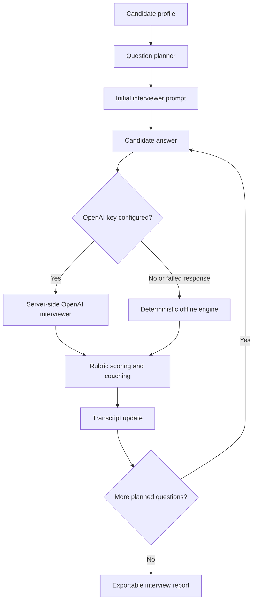

# Architecture

Interview Practice Bot is a React client backed by an Express API. Live coaching can use OpenAI from the server. The same API falls back to a deterministic offline engine when no API key is configured or a model response is unavailable.

## Use cases

- Practice before recruiter screens, hiring manager rounds, technical deep dives and system design interviews.
- Run a focused coaching session around a target role, seniority, interview type and skill list.
- Collect answer scores and improvement prompts after each response.
- Export a readable practice report for later review, coaching notes or a next practice plan.
- Demo interview preparation workflows without networked AI access.

## Session flow

The diagram source is [architecture.mmd](architecture.mmd).

Question planning starts from the selected role, seniority, interview type and normalized skills. The planner creates an opening question, skill specific questions and a closing prompt for the interview type. It limits the session to a short practice round.

Scoring evaluates each answer against four rubric categories: relevance, technical depth, specificity and communication. The deterministic scorer looks for role and skill alignment, expected signals, concrete metrics, tradeoff language, action language and answer structure. It returns an overall score from 0 to 100 with improvement prompts.

Transcript handling keeps interviewer and candidate messages in the session state. Export builds a plain text interview report containing the profile, status, scores, rubric feedback, improvement notes and full transcript.

The Vite dev server proxies `/api` to the Express server on `127.0.0.1:8787`.

## Components

| Path | Role |
| --- | --- |
| `server/app.ts` | Express routes for health, interview start, turns and export |
| `server/index.ts` | API server entry point |
| `server/openaiInterviewer.ts` | Server only OpenAI integration with offline fallback |
| `server/validation.ts` | Request schemas and validation helpers |
| `src/main.tsx` | React interview workspace |
| `src/styles.css` | App styling |
| `src/domain/offlineEngine.ts` | Deterministic interview turn engine |
| `src/domain/questionPlanner.ts` | Question planning from role, seniority, type and skills |
| `src/domain/rubric.ts` | Answer scoring and coaching prompts |
| `src/domain/transcript.ts` | Plain text report export |
| `src/domain/types.ts` | Shared interview types |
| `tests/*.test.ts` | API validation, planner, scoring and export coverage |
| `.github/workflows/ci.yml` | CI install, audit, outdated, lint, test and build checks |
| `.github/dependabot.yml` | npm and GitHub Actions dependency update configuration |
